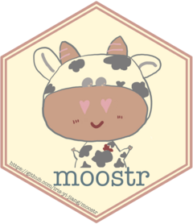

<!-- README.md is generated from README.Rmd. Please edit that file -->

```{r, include = FALSE}
knitr::opts_chunk$set(
  collapse = TRUE,
  comment = "#>",
  fig.path = "man/figures/README-",
  out.width = "100%"
)
```

# moostr <a href="https://iris-yi-jiang.github.io/moostr/"></a>

<!-- badges: start -->
[](https://lifecycle.r-lib.org/articles/stages.html#experimental)
<!-- badges: end -->

## Installation

You can install the development version of moostr via:

``` r
# install.packages("remotes")
remotes::install_github("iris-yi-jiang/moostr")
```
## Overview

`moostr` generates a Moodle syntax string for a given list of possible answers and their corresponding rewards. It allows the user to conveniently allocate rewards for multiple correct and partially correct answers for multichoice and numerical questions. `moostr` also randomly shuffles the answer list for multichoice questions.

For `moostr` to function properly, it is necessary to set the question type for both multichoice and numerical questions to vertatim type. The returned Moodle syntax string can then be directly used as the solution to a verbatim item in an Embedded Answers (Cloze) exercise with `exams` or Moodle. 

## Example

This is a basic example:

```{r example, eval=TRUE}
library(moostr)
make_moostr(type="mchoice", ans=c("A two-sample t-test",
"A paired t-test", "A one-sample t-test"), reward=c(50, 100, 0))
```
